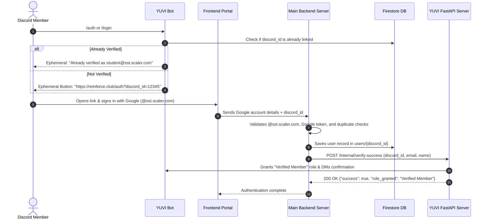

# YUVI 🤖

**Utility, Authentication & Ticket Management Discord Bot for Reinforce Club SST**

YUVI powers the Discord operations for Reinforce Club SST, featuring an asynchronous Firestore-backed **Support & Project Ticket System** and a **Google Account Authentication System** integrated with a high-performance **FastAPI / Uvicorn Server**.

---

## 🏗️ Architecture & Project Structure

```text
YUVI/
├── cogs/
│   ├── auth.py               # Member authentication & admin lookup/unlink commands
│   ├── tickets.py            # Ticket panel, slash commands & real-time message sync
│   └── db.py                 # Quick DB utility commands
├── models/
│   ├── __init__.py
│   └── ticket.py             # Data classes, enums, & Firestore serialization models
├── utils/
│   ├── __init__.py
│   ├── firestore_client.py   # Shared Firestore client initializer
│   ├── ticket_manager.py     # Async CRUD operations for Firestore tickets
│   ├── transcript_generator.py # Transcript generation (Text/Markdown)
│   └── user_manager.py       # Firestore user lookup & unlinking operations
├── views/
│   ├── __init__.py
│   ├── ticket_panel.py       # Persistent Category Dropdown Select Menu
│   ├── ticket_modals.py      # Category-tailored interactive modals & thread creation
│   └── ticket_controls.py   # In-thread controls (Claim, Add Member, Transcript, Close)
├── serviceAccountKey.json    # Firebase Admin credentials
├── server.py                 # FastAPI Application & internal webhook endpoints
├── yuvi_bot.py               # Main bot subclass and cog loader
├── main.py                   # Uvicorn entry point
└── pyproject.toml            # Project dependencies
```

---

## 🔐 Member Authentication Flow



### Authentication Slash Commands
- `/auth` (or `/login`): Sends an ephemeral embed with a direct link button to the login portal.
- `/whois <member>` *(Admin only)*: Shows linked Google email, full name, and verification date from Firestore.
- `/whois-email <email>` *(Admin only)*: Shows the Discord member linked to a specific `@sst.scaler.com` email.
- `/unlink <member>` *(Admin only)*: Deletes the user record from Firestore and removes the verified role from the Discord member.

### Internal Webhook API
- **Endpoint**: `POST /internal/verify-success`
- **Headers (Optional)**: `X-Internal-Secret: your_secret`
- **Request Body**:
  ```json
  {
    "discord_id": "123456789012345678",
    "email": "student@sst.scaler.com",
    "name": "Full Name",
    "secret": "optional_secret_here"
  }
  ```
- **Response**:
  ```json
  {
    "success": true,
    "discord_id": "123456789012345678",
    "email": "student@sst.scaler.com",
    "role_granted": "Verified Member",
    "role_assigned": true
  }
  ```

---

## 🎫 Ticket System Categories

| Category | Description | Modal Inputs |
|---|---|---|
| **🚀 SPG Registration / Modification** | Student Project Groups (Product, Kaggle, Research) | Project Name & Track, Team Leader & Members, Estimated Duration, Goals & Summary |
| **⚡ Resource Request** | Cloud/GPU compute, API credits, hardware, mentorship | Project Name, Resources Needed, Progress Proof Links, Justification |
| **💬 Support & Inquiries** | General questions about events, workshops, tracks | Subject, Detailed Question |
| **💡 Idea Jar & Suggestions** | Proposing projects for community or club suggestions | Idea Title, Target Track, Concept & Learning Objectives |
| **🛡️ Report Issue / Misconduct** | Confidential reports for rule violations | Incident Summary, Confidential Details |
| **📦 General / Misc** | Any other inquiries | Subject, Details |

### Ticket Commands
- `/setup-tickets [channel]` *(Admin only)*: Deploys the interactive ticket panel with the category dropdown.
- `/ticket close [reason]`: Closes the ticket, archives the thread, and uploads the transcript.
- `/ticket claim`: Claims the ticket for the interacting admin/lead.
- `/ticket add <member>`: Adds a collaborator or team member to the private ticket thread.
- `/ticket remove <member>`: Removes a user from the ticket thread.
- `/ticket transcript`: Exports and downloads the complete chat transcript.
- `/ticket info`: Displays Firestore database metadata for the active ticket.
- `/ticket list [status] [category]` *(Admin only)*: Lists active tickets stored in Firestore.

---

## 🚀 Running Locally

1. Copy `.env.example` to `.env` and fill in your credentials:
   ```bash
   cp .env.example .env
   ```

2. Run the server and bot with Uvicorn:
   ```bash
   python main.py
   ```
   or using `uvicorn` directly:
   ```bash
   uvicorn server:app --host 0.0.0.0 --port 8000
   ```
